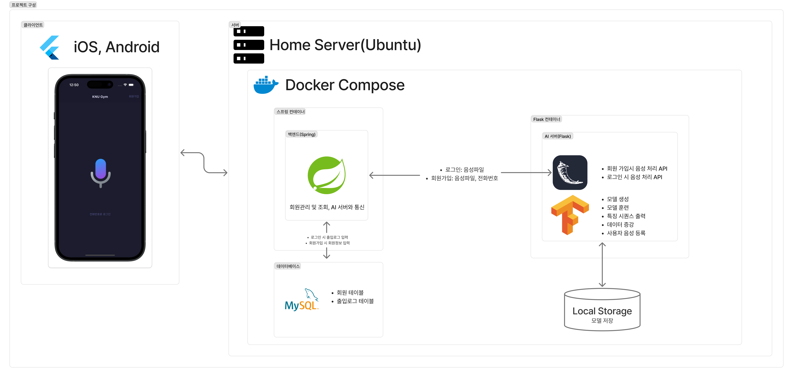

# 🎙️ 개요

- AI 음성 인식 기반 헬스장 출입 시스템을 위한 백엔드 서버

# ⭐ 핵심 구현 내용

- 회원 등록
- 음성인식 기반 회원 로그인(AI모델 연동)
- 회원 조회, 삭제, 수정 등 기본적인 CRUD 지원
- 로그인 시 데이터베이스에 출입 로그 기록
- 타임리프를 통한 회원관리 페이지

--- 

# 🎨 프로젝트 구성도

   

--- 

# 📚 기술스택

- Language: Java 21
- BE Framework: Spring 3.4.3
- ORM: JPA
- Database: MySQL
- Container & Orchestration: Docker, Docker Compose

 
 
   
     
    
    
    
    

